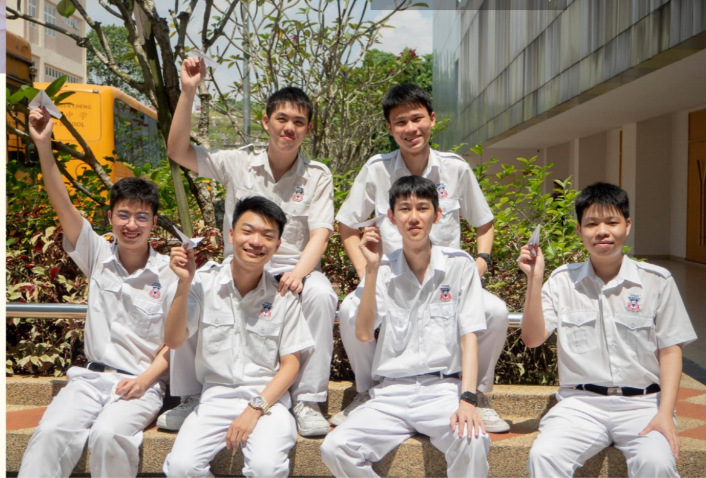

# What's up!!!
# Kwan Weng Hin's dashboard
*Failing is just another word for growing. We can learn anything*

-----------------------------------------------------
## My profile
 

> Name                : Kwan Weng Hin 关永轩
>
> Gender              : Male
>
> Birthday            : 6th of January 2004
>
> Relationship status : Single
>
>Favourite Food       : Nasi Lemak, Curry noodles, Chicken Rice, Bak Kut Teh （肉骨茶）
>
>Favourite Drinks     : Hainam Kopi
>
>Hobby                : Playing Video Games, Reading 
>
>Interest Field       : Robotics| Computer Vision | Machine Learning | Deep Learning | Data Science
>
>Contact              : I rather not tell you but i still have to provide email for work (AIT2302010@xmu.edu.my)

-----------------------------------------------------

# Skills

 ## |Spoken Languages|
1. Chinese (Native Proficiency)
2. English (Intermediate Proficiency)
3. Malay   (Elementary Proficiency)

 ## |Spoken Dialect|
1. Canthonese (Elementary Proficiency)
2. Hokkien (I just understand few words :P) 

 ## |Programming language|
1. C/C++
2. C#
3. Python
4. HTML
5. CSS
6. Arduino
7. R

